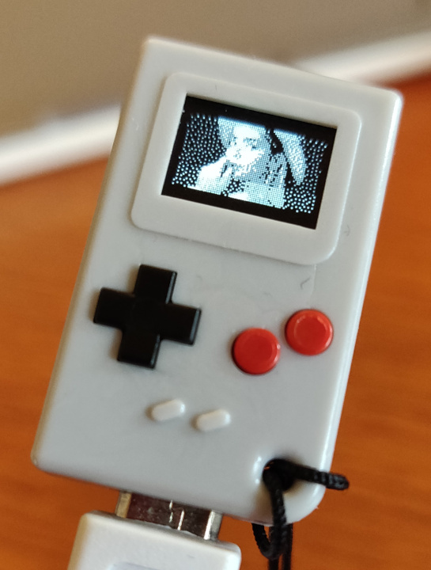
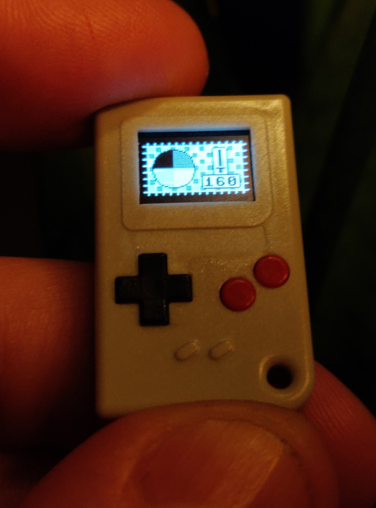

# Grayscale on Thumby

This is an attempt at a little library to bring **grayscale** to the
[Thumby](https://thumby.us/)!

The Thumby display is intended to only be able to show black and white images.
But we can flicker images really quickly and get a pretty convincing grayscale
picture 📺

**Warning:** This is very experimental and may hurt your Thumby or just randomly
*crash. Don't rely on this for anything 😉


<br/>_Showing a photo in four colours on the Thumby (horizontal banding is a result of the timing difference between the display and the camera)_

## How to use

This library uses a thread running on the second core of the Thumby CPU, so that
the first core remains fully available to your game or program using grayscale.
You do not have to do any special magic in your main loop or rendering logic to
show the grayscale effect.

**Note that this library DOES NOT WORK in the emulator AT ALL!**

First, import the library. Copy the file [`grayscale.py`](./grayscale.py) to
your project directory and import like so, making sure you change the path to
the directory of your game:

```python
# Fix import path so it finds the grayscale module
import sys
sys.path.append('/Games/<Your game name here>')

# Do actual import
import grayscale
```

Next, tell the Thumby library to not touch the display and tell the grayscale
library to take over:

```python
thumby.display.setFPS(0)
gs = grayscale.Grayscale()
```

Now we can use the drawing functions from the grayscale library (instead of the
Thumby library) to put grayscale sprites on the screen:

```python
sprite = gs.Sprite(16, 16, bytearray([ <layer 1> ]), bytearray([ <layer 2> ]))
sprite.x = 28
sprite.y = 12
gs.drawSprite(sprite)
```

You can let the user calibrate the timing with a little graphical interface by
calling:

```python
gs.calibrationTool()
```

See photo below.

The timing values are saved to a configuration file in the Thumby root as
`grayscale.conf.json` and loaded the next time your grayscale application (or
someone else's) starts.

If your application exits back to the menu, or you want to switch back to black
and white, make sure you stop the grayscale library:

```python
gs.stop()
```

See [`GrayscaleTest.py`](./GrayscaleTest.py) for a complete example.


<br/>_Showing the calibration screen_

# Implementation notes and links

The Thumby uses the SSD1306 display driver chip. According to some people in the
Arduboy community, some versions of this chip have a ["hidden pin" called
FR](https://community.arduboy.com/t/what-is-pin-7-on-the-oled-nothing/2740/35),
that allows for [perfect
synchronisation](https://community.arduboy.com/t/greyscale-2bit-4-colour-success-with-ssd1306/6835).

However, as far as we know this synchronisation is not available to us on the
Thumby. So instead, we have to match our synchronisation frequency by trial and
error, and even then, accept some noise in the image. At least until someone
figures out a way to synchronize our code to the display driver in some other
way.

This library gains some speed by bypassing the [Thumby
library](https://github.com/TinyCircuits/TinyCircuits-Thumby-Code-Editor/blob/master/ThumbyGames/lib/thumby.py)
and even the [wrapper library for the display
driver](https://github.com/micropython/micropython/blob/master/drivers/display/ssd1306.py).
That is why the code that shows a
[`FrameBuffer`](https://docs.micropython.org/en/v1.15/library/framebuf.html) on
the display may seem a bit foreign.

For more information on the multithreading used, see the [regular Python
documentation on
threading](https://docs.python.org/3.7/library/_thread.html#module-_thread).

## On colours

The grays are a little too light when just naively showing one layer for two
thirds of the time and the other layer for one third of the time. The "dark"
gray is more like a medium gray and the light gray is close to invisible. Which
is why I opted to have three "layers": showing layer one for half the time,
layer two for a quarter of the time and **both layers** (as the "third layer")
for the last quarter. This effectively shows dark gray for three quarters of the
time and light gray for half the time.

## What kinda worked

```
Display image (9500)
sleep 1500
sleep 9500
sleep 1500
Display image (9500)
sleep 1500
------- +
33.000 usec -> 33ms -> 30,3030fps
```

## What didn't work

Just spam images as fast as possible, basically this in a loop:

```python
disp.cs(1)
disp.dc(1)
disp.cs(0)
disp.spi.write(buf1)
disp.cs(1)

disp.cs(1)
disp.dc(1)
disp.cs(0)
disp.spi.write(buf1)
disp.cs(1)

disp.cs(1)
disp.dc(1)
disp.cs(0)
disp.spi.write(buf2)
disp.cs(1)

disp.cs(1)
disp.dc(1)
disp.cs(0)
disp.spi.write(buf3)
disp.cs(1)
```

This just shows flickering black and white images. Probably because the
frequency of the display driver chip interferes with the frequency of this loop
in interesting ways. That shows, however, that we can send images to the driver
chip very quickly, and we're in no way limited by the speed of the display when
writing images.
