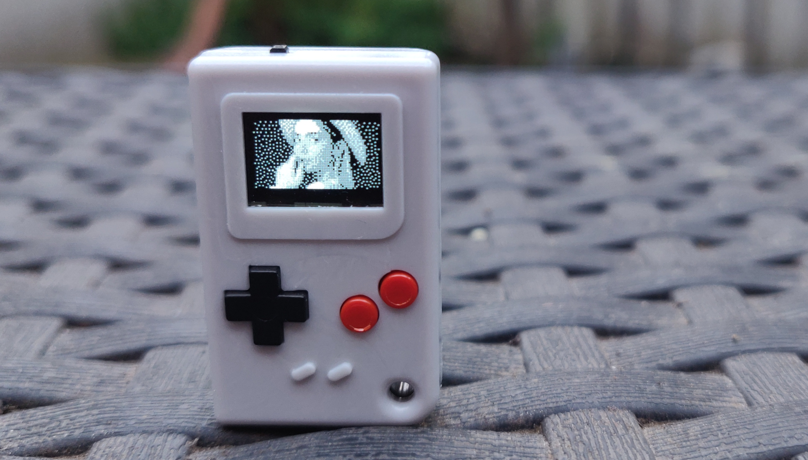

# Grayscale on Thumby

This library brings **grayscale** to the [Thumby](https://thumby.us/)!

The Thumby display is intended to only be able to show black and white images.
But we can flicker images really quickly and get a very convincing grayscale
picture 📺✨


<br/>_Showing a photo in four colours on the Thumby_

## How to use

This library uses a thread running on the second core of the Thumby CPU, so that
the first core remains fully available to your game or program. You do not have
to do any special magic in your main loop or rendering logic to show the
grayscale effect. Just import and start the library, and use its functions
instead of the functions of `thumby.display`.

We have dubbed the second core that's running the grayscale thread the GPU:
_Grayscale Processing Unit_ 😉

### Caveats

Before we get started, make sure you are aware of the limitations of this
library:

* The [code.thumby.us](https://code.thumby.us) Thumby emulator is not
  multithreaded. That's why this library **DOES NOT WORK in the emulator AT
  ALL!**
* This library requires **MicroPython v1.19.1 or higher**. Trying to initialize
  the library on anything lower will throw an exception.
* The grayscale image is pretty stable. But it's basically still just flashing
  images one after another in quick succession. This may **not be suitable for
  people who suffer from epilepsy**.
* It's still pretty early-days for grayscale on the Thumby and we don't know for
  sure that this will not **hurt your Thumby's display** long term. We've been
  doing quite a lot of testing with it though, and so far zero Thumbys have
  developed issues.
* It will probably **drain the battery** faster because it's doing some pretty
  CPU intensive things.

Having said all that, let's get some grayscale going! 😄 See
[`GrayscaleTest.py`](./Games/GrayscaleTest/GrayscaleTest.py) for a complete
example, or keep reading for more of a guide.

### Getting it going

First, import the library. Copy the file [`grayscale.py`](./grayscale.py) to
your project directory and import like so:

```python
# Fix import path so it finds the grayscale library
import sys
sys.path.insert(0, "/".join(__file__.split("/")[0:-1]))

# Do actual import
import grayscale
```

Next, tell the grayscale library to take over the display:

```python
gs = grayscale.Grayscale()
```

From here on, **do not** use any of the `thumbyGraphics` or `thumby.display`
methods to draw things to the screen. If you do, the display will not show
anything.

### Drawing in four colours

Now we can use the drawing functions from the grayscale library (instead of the
Thumby libraries) to put grayscale images on the screen. All the functions you
are used to are still available, but now require you to specify a colour or to
supply two layers of bitmap data. Make sure you use `grayscale.Sprite` for your
sprites:

```python
cat = grayscale.Sprite(
    12, 9,         # Dimensions
    bytearray([    # Layer 1 data
        175,7,169,254,237,255,191,157,190,233,255,175,
        1,1,0,1,1,1,1,1,1,1,1,1
    ]),
    bytearray([    # Layer 2 data
        255,255,87,7,3,3,3,67,3,7,7,255,
        1,1,1,0,0,0,0,0,0,0,1,1
    ]),
    30, 15         # Position
)
gs.drawSprite(cat)
gs.update()
```

As you can see, sprites are now composed of two layers instead of just a single
bitmap. The colour of a pixel is defined by the values in both layers:

| Layer 1 | Layer 2 | Colour                                           |
|---------|---------|--------------------------------------------------|
| 0       | 0       |  Black           |
| 1       | 0       |  Dark gray    |
| 0       | 1       |  Light gray  |
| 1       | 1       |  White           |

The text, line drawing and filling functions can now be used with four colours
instead of two, like so:

```python
gs.fill(gs.BLACK)
gs.drawFilledRectangle(16, 9, 40, 21, gs.WHITE)
gs.drawText("Hello", 18, 11, gs.LIGHTGRAY)
gs.drawText("world!", 18, 19, gs.DARKGRAY)
gs.update()
```

| Constant       | Value | Colour                                           |
| -------------- |-------|--------------------------------------------------|
| `gs.BLACK`     | 0     |  Black           |
| `gs.DARKGRAY`  | 1     |  Dark gray    |
| `gs.LIGHTGRAY` | 2     |  Light gray  |
| `gs.WHITE`     | 3     |  White           |

### Using the buffers directly

For more advanced stuff, you may want to access the display buffers for the two
grayscale layers directly. These exist in two `bytearray`s at these locations:

```python
gs.buffer1
gs.buffer2
```

You can wrap these in a
[`FrameBuffer`](https://docs.micropython.org/en/v1.15/library/framebuf.html) if
you want, and manipulate the `bytearray`s to your heart's content. Make sure you
call `gs.update()` or `gs.show()` afterwards, to show the result on the screen.

### Stopping

If your application exits back to the menu, or you want to switch back to black
and white, make sure you stop the grayscale library's thread:

```python
gs.stop()
```

## Implementation notes and links

The Thumby uses the SSD1306 display driver chip. According to some people in the
Arduboy community, some versions of this chip have a ["hidden pin" called
FR](https://community.arduboy.com/t/what-is-pin-7-on-the-oled-nothing/2740/35),
that allows for [perfect
synchronisation](https://community.arduboy.com/t/greyscale-2bit-4-colour-success-with-ssd1306/6835).
However, as far as we know this synchronisation is not available to us on the
Thumby. So instead we have to match the synchronisation frequency in software
somehow.

We have first done this by having a second thread on the CPU sleep for a fixed
number of microseconds, the value of which was found by trial and error. This
kinda worked, but resulted in a fairly unstable, somewhat noisy image.

But then @Doogle figured out a way to synchronize our code to the display driver
in a more clever way, by "resetting" the display controller in such a way that
we can absorb the margin of error in the timing. I'll let him explain further:

### How the grayscale effect is achieved

The method used to create reduced flicker greyscale using the SSD1306 uses
certain assumptions about the internal behaviour of the controller. Even though
the behaviour seems to back up those assumptions, it is possible that the
assumptions are incorrect but the desired result is achieved anyway. To simplify
things, the following is written as if the assumptions _are_ correct.

We keep the display synchronised by resetting the row counter before each frame
and then outputting a frame of 57 rows. This is 17 rows past the 40 of the
actual display.

Prior to loading in the frame we park the row counter at row 0 and wait for the
nominal time for 8 rows to be output. This (hopefully) provides enough time for
the row counter to reach row 0 before it sticks there. (Note: recent test
indicate that perhaps the current row actually jumps before parking)

<br/> _An
approximation of what the thread is doing and what we think is happening inside
the controller_

The 'parking' is done by setting the number of rows (aka 'multiplex ratio') to 1
row. This is an invalid setting according to the datasheet but seems to still
have the desired effect.

Once the frame has been loaded into the display controller's GDRAM, we set the
controller to output 57 rows, and then delay for the nominal time for 48 rows to
be output.

Considering the 17 row 'buffer space' after the real 40 rows, that puts us
around halfway between the end of the display, and the row at which it would
wrap around.

By having 8.5 rows either side of the nominal timing, we can absorb any
variation in the frequency of the display controller's RC oscillator as well as
any timing offsets introduced by the Python code.

We further enhance the greys by modulating the contrast differently for each
frame.

### Other links

This library gains some speed by bypassing the [Thumby
library](https://github.com/TinyCircuits/TinyCircuits-Thumby-Code-Editor/blob/master/ThumbyGames/lib/thumby.py)
and even the [wrapper library for the display
driver](https://github.com/micropython/micropython/blob/master/drivers/display/ssd1306.py).

For more information on the multithreading used, see the [regular Python
documentation on
threading](https://docs.python.org/3.7/library/_thread.html#module-_thread).
