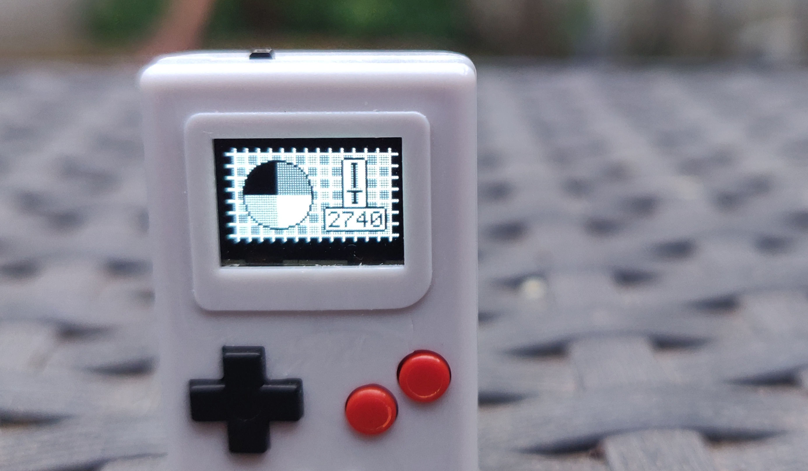

# Grayscale on Thumby

This is a little library to bring **grayscale** to the
[Thumby](https://thumby.us/)!

The Thumby display is intended to only be able to show black and white images.
But we can flicker images really quickly and get a pretty convincing grayscale
picture 📺✨


<br/>_Showing a photo in four colours on the Thumby_

## How to use

This library uses a thread running on the second core of the Thumby CPU, so that
the first core remains fully available to your game or program. You do not have
to do any special magic in your main loop or rendering logic to show the
grayscale effect. Just import and start the library, and use its functions
instead of the functions of `thumby.display`.

### Caveats

Before we get started, make sure you are aware of the limitations of this
library:

* The [code.thumby.us](https://code.thumby.us) Thumby emulator is not
  multithreaded. That's why this library **DOES NOT WORK in the emulator AT
  ALL!**
* Touching flash memory while the grayscale thread is running sometimes
  **crashes the Thumby**. The solution is to stop the grayscale thread, save
  your file or whatever you want to do, and then restart the thread.
* The framerate limiting logic of `thumby.display` (`update` and `setFPS`) has
  not (yet) been implemented. This is not a technical limitation or anything,
  I've just been too lazy so far 😉
* The grayscale image is not perfectly stable. Depending on the timing settings
  and the image shown, it flickers a bit and some banding may occur. This
  may **not be suitable for people who suffer from epilepsy**. Also, you may
  just find the quality unsuitable for your application.
* This is very experimental and **may hurt your Thumby's display** long term. I
  don't know for sure that it doesn't, it hasn't been used for long enough to
  know. It will also probably **drain the battery** pretty quickly.

So in short: Don't rely on this library for anything if you're not the
adventurous type 😉

Having said all that, let's get some grayscale going! 😄 See
[`GrayscaleTest.py`](./GrayscaleTest.py) for a complete example, or keep
reading for more of a guide.

### Getting it going

First, import the library. Copy the file [`grayscale.py`](./grayscale.py) to
your project directory and import like so:

```python
# Fix import path so it finds the grayscale library
import sys
sys.path.insert(0, "/".join(__file__.split("/")[0:-1]))

# Do actual import
import grayscale
```

Next, tell the Thumby library to not touch the display and tell the grayscale
library to take over:

```python
thumby.display.setFPS(0)
gs = grayscale.Grayscale()
```

### Drawing in four colours

Now we can use the drawing functions from the grayscale library (instead of the
Thumby library) to put grayscale images on the screen. Nearly all functions of
`thumby.display` are available to use. Make sure you use `grayscale.Sprite`
instead of `thumby.Sprite` though:

```python
cat = grayscale.Sprite(
    12, 9,         # Dimensions
    bytearray([    # Layer 1 data
        175,7,169,254,237,255,191,157,190,233,255,175,
        1,1,0,1,1,1,1,1,1,1,1,1
    ]),
    bytearray([    # Layer 2 data
        255,255,87,7,3,3,3,67,3,7,7,255,
        1,1,1,0,0,0,0,0,0,0,1,1
    ]),
    30, 15         # Position
)
gs.drawSprite(cat)
```

As you can see, sprites are now composed of two layers instead of just a single
bitmap. The colour of a pixel is defined by the values in both layers:

| Layer 1 | Layer 2 | Colour                                                                     |
|---------|---------|----------------------------------------------------------------------------|
| 0       | 0       |  Black      |
| 0       | 1       |  Light gray |
| 1       | 0       |  Dark gray  |
| 1       | 1       |  White      |

The text, line drawing and filling functions can now be used with four colours
instead of two, like so:

```python
gs.fill(gs.BLACK)
gs.drawFilledRectangle(16, 9, 40, 21, gs.WHITE)
gs.drawText("Hello", 18, 11, gs.LIGHTGRAY)
gs.drawText("world!", 18, 19, gs.DARKGRAY)
```

| Constant       | Value | Colour                                                                     |
| -------------- |-------|----------------------------------------------------------------------------|
| `gs.BLACK`     | 0     |  Black      |
| `gs.LIGHTGRAY` | 1     |  Light gray |
| `gs.DARKGRAY`  | 2     |  Dark gray  |
| `gs.WHITE`     | 3     |  White      |

### Using the buffers directly

For more advanced stuff, you may want to access the display buffers for the two
grayscale layers directly. These exist in two `bytearray`s at these locations:

```python
gs.gsBuffer1.buffer
gs.gsBuffer2.buffer
```

You can wrap these in a
[`FrameBuffer`](https://docs.micropython.org/en/v1.15/library/framebuf.html) if
you want, and manipulate the `bytearray`s to your heart's content. Make sure you
call `gs._joinBuffers()` after you are done manipulating though, so the colours
are correct. See below at [On colours and the "third
layer"](#on-colours-and-the-third-layer) for more background information.

### Calibration

You can let the user calibrate the timing with a little graphical interface by
calling:

```python
grayscale.Calibration(gs).start()
```


<br/>_Showing the calibration screen_

In this calibration screen, up and down change the grayscale timing in large
increments, left and right in small increments, A or B confirms the new setting.
The value shown on screen is the tens of microseconds that a full update cycle
should take. So in the photo, the screen is cycled every 27,4 milliseconds (or
36,5 frames per second), which is the default value. This value seems to give me
pretty stable results.

The timing values are loaded from a configuration file in the Thumby root
(`grayscale.conf.json`) whenever a grayscale application starts. If you want to
save the new configuration so it survives a restart / reboot, after using the
calibration screen, you have to stop the grayscale thread, save the current
configuration and restart the thread:

```python
gs.stop()
gs.saveConfig()
gs = grayscale.Grayscale()
```

_As mentioned above under [caveats](#caveats), you have to stop the grayscale
thread every time you do anything touching the flash memory to prevent crashes,
including saving the grayscale configuration._

### Stopping

If your application exits back to the menu, or you want to switch back to black
and white, make sure you stop the grayscale library's thread:

```python
gs.stop()
```

# Implementation notes and links

The Thumby uses the SSD1306 display driver chip. According to some people in the
Arduboy community, some versions of this chip have a ["hidden pin" called
FR](https://community.arduboy.com/t/what-is-pin-7-on-the-oled-nothing/2740/35),
that allows for [perfect
synchronisation](https://community.arduboy.com/t/greyscale-2bit-4-colour-success-with-ssd1306/6835).

However, as far as we know this synchronisation is not available to us on the
Thumby. So instead, we have to match our synchronisation frequency by trial and
error, and even then, accept some noise in the image. At least until someone
figures out a way to synchronize our code to the display driver in some other
way.

This library gains some speed by bypassing the [Thumby
library](https://github.com/TinyCircuits/TinyCircuits-Thumby-Code-Editor/blob/master/ThumbyGames/lib/thumby.py)
and even the [wrapper library for the display
driver](https://github.com/micropython/micropython/blob/master/drivers/display/ssd1306.py).
That is why the code that shows the buffers on
the display may seem a bit foreign.

For more information on the multithreading used, see the [regular Python
documentation on
threading](https://docs.python.org/3.7/library/_thread.html#module-_thread).

## On colours and the "third layer"

The grays are a little too light when just naively showing one layer for two
thirds of the time and the other layer for one third of the time. The "dark"
gray is more like a medium gray and the light gray is close to invisible. Which
is why I opted to have three "layers": showing layer one for half the time,
layer two for a quarter of the time and **both layers** (as the "third layer")
for the last quarter. This effectively shows dark gray for three quarters of the
time and light gray for half the time, which gives a much better result.

The third layer is managed automatically, and is only of concern if you're
bypassing the GraphicsClass functions and manipulating the GsBuffers yourself.
In that case, call `gs._joinBuffers()` after manipulating the first two layers
to generate the third.
